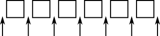

# More Generic Programming

## Lists and Sets

### ArrayList and LinkedList

- Two obvious ways to represent a list

```java
ArrayList <T>
LinkedList <T>
```

- LinkedList: more efficient in applications where items will often be added or removed at the beginning of the list or in the middle of the list
- ArrayList: more efficient when random access to items is required
- Both operations: efficiently when sorting and adding an item at the end of the list

#### Methods

- [Methods for List (LinkedList and ArrayList)](./examples/src/ListMethods.java)
- [Additional methods for LinkedList](./examples/src/LinkedListOnlyMethods.java)

#### Lists Iterator

```
ListIterator<T>
```

- 
- Like Collection Iterator, return by `list.listIterator()` method
- [List Iterator Methods](./examples/src/ListIteratorMethods.java)

#### Sorting

```java
Collection.sort(list) // merge-sort
Collection.sort(list, comparator)
```

- Comparator: Object that defines a `compare()` method that can be used to compare two objects
- Other methods of Collections

```java
Collections.shuffle(list) // rearrange the elements into a random number
Collections.reverse(list) // reverve the order of the elements
```

### TreeSet and HashSet

- No element occurs twice in the set
- Java has two classes that implement the interface `Set<T>`

```java
java.util.TreeSet
java.util.HashSet
```

#### TreeSet

- has the property that the elements of the set are arranged into ascending sorted order => `Iterator` will always visit the elements of the set in ascending order
- cannot hold arbitrary objects (đối tượng tùy ý)
- objects in a set of type `TreeSet<T>` should implement the interface `Comparable<T>`
- Does not use `equals()` method to test whether 2 objs are the same => use `compare()` or `compareTo()` instead
- `Comparator` có thể đánh giá hai objects là giống nhau để phục vụ cho một mục đích nào đó (dù chúng không thực sự giống nhau)
- **Notes**: Phải biết ngữ nghĩa của TreeSets và cần đảm bảo `compare()` và `compareTo()` được xác định một cách hợp lý cho object mà bạn đưa vào TreeSet
- In the implementation of a TreeSet, the elements are stored in something similar to a **binary sort tree**. However, the data structure that is used is **balanced**

```java
TreeSet<String> words = new TreeSet<String>();
```

#### HashSet

- store elements in a **hash table**
- The operations of finding, adding, and removing elements are implemented very efficiently in hash tables, even more so than for TreeSets
- The elements of a HashSet are not stored in any particular order, and so do not need to implement the Comparable interface
- Using `equals()`
- Use a HashSet instead of a TreeSet when
  - the elements it contains are not comparable,
  - when the order is not important,
  - when the small advantage in efficiency is important
- [HashSet Methods](./examples/src/HashSetMethods.java)

### Priority Queues

- ADT that presents a collection of items, **where each item has an assigned "priority" that allows any two items to be compared**

```java
PriorityQueue<T>
```

- This class implements the interface `Collection<T>`

## Maps

- A map is like an array, but the indices for a map are objects, not integers => called _key_
- The object that is associated with a key is called a _value_

### The map interface

- `Map<K,V>`

  - `K`: specifies the type of objects that are possible keys in the map
  - `V`: specifies the type of objects that are possible values in the map

- [Map Methods](./examples/src/MapMethods.java)
- two classes that implement the interface `Map<K,V>`
  - `TreeMap<K,V>`
  - `HashMap<K,V>`

#### TreeMap

- the key/value associations are stored in a sorted tree, in which they are sorted according to their keys
- must implement the interface Comparable<K>, or that a Comparator must be provided for comparing keys
- Like TreeSet, it use `compareTo()` (or `compare()`) method to decide whether two keys are to be considered the same

### HashMap

- does not store associations in any particular order => key do not have to be comparable
- should use a HashMap unless you have some particular need for the ordering property of a TreeMap.

## Views, Subset, SubMaps

### Views

- `map.keySet()`:
  - returns the set of all objects that occur as keys for associations in the map
  - value returned by this method is an object that implements the interface `Set<K>`
  - The value returned by map.keySet() _is not an independent object_ => it is _view_ of actual object => if you remove a key from the view, that key—along with its associated value—is actually removed from the map
  - [Map Views Example](./examples/src/MapIterator.java)
- `map.values()`: returns an object of type `Collection<V>` that contains all the values from the associations that are stored in the map
- `map.entrySet()`:
  - returns a set with objects of type `Map.Entry<K,V>` that contains all the associations from the map
  - returned objects in a set have `entry.getKey` and `entry.getValue` methods

### Sublist / SubSet / Submap

#### Sublist

- `list.subList( fromIndex, toIndex )`: returns a view of the part of the list consisting of the list elements in positions between fromIndex and toIndex (including fromIndex but excluding toIndex)

#### Subset

- `set.subSet(fromElement,toElement)`: returns a `Set<T>` that contains all the elements of set that are between fromElement and toElement (including fromElement and excluding toElement)
- `set.headSet(toElement)`: consists of all elements from the set which are strictly less than toElement
- `set.tailSet(fromElement)`: view that contains all elements from the set that are greater than or equal to fromElemen

#### Submap

- `map.subMap(fromKey,toKey)`: returns a view that contains all key/value pairs from map whose keys are between fromKey and toKey (including fromKey and excluding toKey)
- `map.headMap(toKey)`
- `map.tailMap(fromKey)`

### Hash Tables and Hash Codes

- A hash table, like a HashMap, stores key/value pairs. Given a key, you have to search the table for the corresponding key/value pair
- When a hash table is used to implement a set, there are no values, and the only question is whether or not the key occurs in the set
- hash tables store their data in an array, and the array index where a key is stored is based on the key. **The index is not equal to the key, but it is computed from the key** => **hash code**
- A function that computes a hash code, given a key, is called a **hash function**
- **collision**: try to store two or more keys in the same array location => When two items have the same hash code, they are in the same linked list
  
- For hashing to work properly, two objects that are equal according to the equals() method must have the same hash code
- Redefine `equals()` => redefine `hashCode()`

## Programming with the Java Collection Framework

### Symbol Tables

- Khi compiler đọc sourcode, nó sẽ gặp các định nghĩa của biến, methods, classes => chúng ta phải lấy được value của biến đó để biên dịch. Ví dụ

```
let x = 3 + 12
print 2 + 2
print 10*x +17
let rate = 0.06
print 1000*(1+rate)
```
