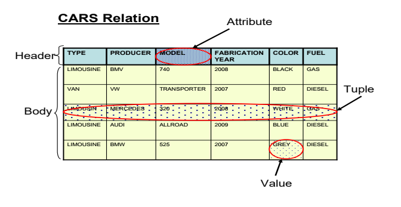
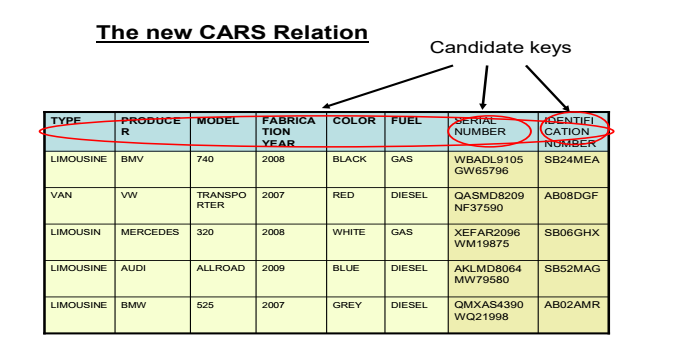

# The relational data model

## Relational data model: The big picture

- Communication tool between designers, programmers and end users of a database
- Some new words
  - entity integrity: tính toàn vẹn của thực thể
  - referential integrity: tính toàn vẹn tham chiếu
  - semantic constraints: rảng buộc ngữ nghĩa
  - relational algebra: đại số quan hệ
  - relational calculus: phép tính quan hệ

## Basic concepts

### Attributes

- characteristic of data
- has to have a name -> refer to that feature
- the name has to be as relevent as possibles for that feature
- Example: For a person, the attributes can be
  - Name
  - Sex
  - DateOfBirth

### Domains

- A set of atomic values (giá trị nguyên tử) that are all of the same type (attribute)
  - A value is the smallest unit of data in the relational model
  - Example: The domain for the `Producer` is the set of all possible car producer names (like BMW, Audi, VW...)

= Domain has a name and a dimesion (number of values that domain has)

- Domains have a certain operational significance
  - If two attribute draw their value from 1 domain => comparisons make sense
  - If two attribute draw their value from different domains => comparisons dose not make sense

### Tuples

- An ordered set of values that describe data characteristics at one moment in time
- Informal terms: row in a table or record in a data file

### Relations

- Relation consists of a heading and a body

  - Heading: consists of a fixed set of attributes
  - Body: consists of a time-varying set of tuples
  - Relation degree: = the number of attributes on that relation (columns)
  - Relation cardinality (số lượng): = the number of tuples of that relation (rows)
  - Relation instance: state in which a relation exists at one moment in time

- Important properties
  - There are no duplicate tuples in a relation
  - Tuples are unordered
  - Attributes are unordered
  - All attribute values ar atomic

### Schemas

- Formal descrition of all the database relations and all the relationships existing between them

### Keys

- Used to define identifier for a relation's tuples

#### Candidate keys

- unique identifier for the tuples of a relation
- Every relation has at least one candidate key (the combination of all of its attributes)
  ;

- If relation has more than one candidate key
  - the one that is chosen to represent the relation is called the **primary key**
  - the remaining candidate keys are called **alternate keys**

#### Primary keys

- unique identifier for the tuples of a relation
- it is a **candidate key** that is chose to represent the relation in the database
- Relational DBMS allow a primary key to be specified the moment you create the relation (table)
- **surrogate key (khóa thay thế)**, **artifical key (khóa nhân tạo)**: ID with no meaning to real-world data, have unique values and will be used as a primary key

#### Foreign keys

- an attribute in one relation R2 whose values a required to match those of the primary key of some relation R1
- foreign key and the corresponding primary key should be defined on the same inderlying domain

## Relational data model constraints (Ràng buộc mô hình dữ liệu quan hệ)

- Those rules are general ,specified at the database schema level, must be respected by each schema instance

### Entity integrity constraint (Ràng buộc toàn vẹn thực thể)

- No attribute participating in the primary key of the relation is allowed to accept null values

#### The justification

- Database relations correspond to entities from the real-word => entities in the real-world are distinguishable
- Primary keys perform the unique identification function in the relational model
- null primary key => would be a contradiction (some entity that has no identity that does not exist.)

### Referential integrity constraint (Ràng buộc toàn vẹn tham chiếu)

- If a relation R2 includes a foreign key FK matching the primary key PF of other relation R1, then every value of FK in R2 must either be equal to the value of PK in some tuple of R1 or be wholly null

#### The justification

- If some tuple t2 from relation R2 references some tuple t1 from relation R1. Then t1 must exist
- Given FK value must have a matching PK value somewhere in the referenced relation if that foreign key value is different from null
- Sometimes, it is necessary to permit the foreign key to accept null value

#### Three important questions

- Can the foreign key accept null values
- What should happen on an attempt to delete the primary key value of a foreign key reference? (_delete a car which is owned by a person_)
  - Three possibilities
    1. CASCADE: the delete operation `cascades` to delete those matching tuples (the tuples from the foreign key relation) is deleted too => _if car is deleted - the owner is deleted too_
    2. RESTRICT: the delete operation is `restricted` to the case where are no such matching tuples (it is rejected otherwise - ngược lại thì bị reject) => _the car can be deleted if only it is not owned by a person_
    3. NULLIFIES: the foreign key is set to null in all matching cases and then the tuple containing the primary key value is then deleted (only apply to the case FK accept null values) => _the car can be deleted after the `IdentificationNumber` attribute value from its former owner is set to null_
- What should happen on an attempt to update the primary key value of a foreign key reference?
  - Three possibilities
    1. CASCADE: updates the foreign key value of matching tuples => _if car id number is updated, the car owner id number attribute is updated too_
    2. RESTRICT: the update operation is `restricted` to the case where are no such matching tuples (it is rejected otherwise) => _car id number can only be updated if it is not owned by a person_
    3. NULLIFIES: the foreign key is set to null in all matching cases and then the tuple containning primary key value is updated => _car id number can be updated after the car owner id number attribute is set to null_

### Semantic integrity constraints (Ràng buộc toàn vẹn ngữ nghĩa)

- Refer to the correctness of the meaning of the data (like the street number is always positive number)
- If user attempts to execute and operation that would violate the constraint
  - The system reject the operation
  - Or it will perform some compensating action on some other part if the database to ensure that the overall result is still a correct state

#### Domain constraint

- The value of an attribute must fall within the range of values spetified by the domain

#### Null constraint

- The values of an attribute cannot be null (for example, `FirstName` and `LastName`)

#### Unique constraint

- The value of an attribute must be unique within the set of all tuples (for example, `SerialNumber` of a car in CARS relation)

#### Check constraint

- A prefefined conditional must be satisfied before data can be manipulated (for example, the `BirthYear` can't be greater than `CurrentYear`)
